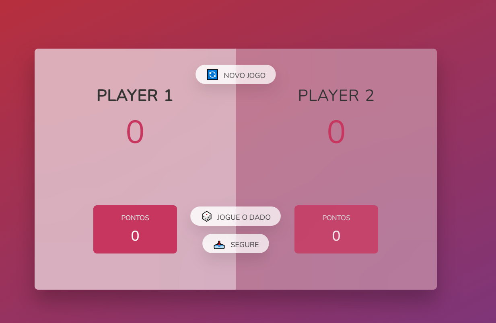

# 🎲 Jogue o Dado

Um jogo de dados para dois jogadores, desenvolvido com **HTML, CSS e JavaScript**, inspirado no clássico **Pig Game**.

O objetivo é simples: acumular pontos ao rolar o dado e decidir o momento certo para guardar sua pontuação. Mas existe um risco: se você tirar **1**, perde todos os pontos acumulados na rodada e passa a vez para o outro jogador.

O primeiro jogador a alcançar **100 pontos** vence a partida! 🏆

---

## 🎮 Demonstração

> Jogue o dado, acumule pontos e escolha o momento certo para segurá-los!

🔗 **[Acessar o projeto]([https://tiagotpk.github.io/jogue_o_dado/])**


---

## 📸 Preview




---

## 🕹️ Como jogar

O jogo possui dois jogadores que se alternam durante a partida.

### 🎲 Rolar o dado

Ao clicar em **"🎲 Jogue o Dado"**, um número entre **1 e 6** é sorteado.

* Se o resultado for de **2 a 6**, o valor é adicionado aos pontos atuais da rodada.
* Se o resultado for **1**, o jogador perde todos os pontos acumulados naquela rodada e a vez passa automaticamente para o próximo jogador.

### 📥 Segurar os pontos

Ao clicar em **"📥 Segure"**, os pontos acumulados na rodada são adicionados à pontuação total do jogador.

Depois disso, a vez passa para o próximo jogador.

### 🏆 Vitória

O jogador que alcançar **100 pontos ou mais** vence a partida.

Quando isso acontece:

* O jogo é encerrado;
* O dado é ocultado;
* O jogador vencedor recebe uma indicação visual;
* O estado de jogador ativo é removido.

### 🔄 Novo jogo

O botão **"🔄 Novo Jogo"** reinicia a partida.

---

## 🧠 Regras do jogo

| Ação               | Resultado                                      |
| ------------------ | ---------------------------------------------- |
| 🎲 Rolar `2–6`     | Soma o valor aos pontos da rodada              |
| 🎲 Rolar `1`       | Zera os pontos da rodada e troca o jogador     |
| 📥 Segurar         | Adiciona os pontos da rodada à pontuação total |
| 🏆 Chegar a `100+` | Vitória                                        |
| 🔄 Novo Jogo       | Reinicia a partida                             |

---

## 🛠️ Tecnologias utilizadas

* **HTML5** — Estrutura e semântica da aplicação
* **CSS3** — Estilização, layout e estados visuais
* **JavaScript (ES6+)** — Lógica e interatividade
* **DOM Manipulation** — Atualização dinâmica dos elementos da página
* **Git & GitHub** — Versionamento e publicação do projeto

---

## 📂 Estrutura do projeto

```text
jogue-o-dado/
│
├── assets/
│   ├── dice-1.png
│   ├── dice-2.png
│   ├── dice-3.png
│   ├── dice-4.png
│   ├── dice-5.png
│   ├── dice-6.png
│   └── preview.png
│
├── index.html
├── style.css
├── script.js
└── README.md
```

---

## 💻 Conceitos de JavaScript praticados

Este projeto foi desenvolvido com foco no aprendizado e na aplicação prática de conceitos fundamentais de JavaScript.

### Variáveis e estruturas de dados

Utilização de variáveis para controlar o estado da aplicação:

```javascript
const scores = [0, 0];
let currentScore = 0;
let activePlayer = 0;
let playing = true;
```

O array `scores` armazena a pontuação total de cada jogador, enquanto `currentScore` representa os pontos acumulados durante a rodada atual.

---

### Manipulação do DOM

O projeto utiliza JavaScript para selecionar e modificar elementos HTML dinamicamente:

```javascript
const diceEl = document.querySelector('.dice');

diceEl.classList.remove('hidden');
diceEl.src = `assets/dice-${dice}.png`;
```

Dessa forma, a interface é atualizada de acordo com as ações realizadas pelo jogador.

---

### Eventos

Os botões utilizam `addEventListener` para responder às interações do usuário:

```javascript
btnRoll.addEventListener('click', function () {
  // lógica para rolar o dado
});
```

O mesmo conceito é utilizado para as ações de segurar os pontos e iniciar um novo jogo.

---

### Geração de números aleatórios

O valor do dado é gerado utilizando:

```javascript
const dice = Math.trunc(Math.random() * 6) + 1;
```

O resultado sempre será um número inteiro entre **1 e 6**.

---

### Funções

A função `switchPlayer()` centraliza a lógica responsável por alternar entre os jogadores:

```javascript
function switchPlayer() {
  document.getElementById(`current--${activePlayer}`).textContent = 0;

  activePlayer = activePlayer === 0 ? 1 : 0;

  currentScore = 0;

  player0El.classList.toggle('player--active');
  player1El.classList.toggle('player--active');
}
```

Isso ajuda a evitar repetição de código e torna a lógica da aplicação mais organizada.

---

### Operador ternário

O operador ternário é utilizado para alternar o jogador ativo:

```javascript
activePlayer = activePlayer === 0 ? 1 : 0;
```

Se o jogador atual for `0`, o próximo será `1`. Caso contrário, será `0`.

---

### Controle de estado

A variável:

```javascript
let playing = true;
```

é utilizada para controlar se a partida ainda está acontecendo.

Quando um jogador vence:

```javascript
playing = false;
```

As ações relacionadas à partida deixam de ser executadas.

---

## 🎯 Objetivos de aprendizagem

Este projeto foi desenvolvido como parte da prática de **JavaScript e desenvolvimento web**, com foco em transformar regras de negócio em código.

Durante o desenvolvimento, foram praticados conceitos como:

* Manipulação do DOM;
* Eventos de clique;
* Funções;
* Arrays;
* Variáveis e constantes;
* Condicionais `if/else`;
* Operador ternário;
* Operadores matemáticos;
* `Math.random()`;
* `Math.trunc()`;
* Template literals;
* Manipulação de classes CSS;
* Controle de estado da aplicação;
* Atualização dinâmica da interface;
* Organização de código JavaScript.

---

## 🚀 Como executar o projeto

### 1. Clone o repositório

```bash
git clone https://github.com/seu-usuario/jogue-o-dado.git
```

### 2. Acesse a pasta

```bash
cd jogue-o-dado
```

### 3. Execute o projeto

Por ser uma aplicação front-end desenvolvida com HTML, CSS e JavaScript puro, não é necessário instalar dependências.

Basta abrir o arquivo:

```text
index.html
```

no navegador.

Também é possível utilizar uma extensão como **Live Server** no Visual Studio Code para executar o projeto durante o desenvolvimento.

---

## 🔮 Possíveis melhorias

Algumas funcionalidades podem ser adicionadas em versões futuras:

* [ ] Permitir que os jogadores informem seus nomes;
* [ ] Adicionar placar de partidas;
* [ ] Adicionar efeitos sonoros;
* [ ] Adicionar animação ao rolar o dado;
* [ ] Criar modo contra o computador;
* [ ] Adicionar diferentes metas de pontuação;
* [ ] Melhorar a experiência em dispositivos móveis;
* [ ] Criar sistema de histórico de partidas;
* [ ] Adicionar modo de jogo com mais de dois jogadores.

---

## 📚 Sobre o projeto

Este projeto faz parte da minha jornada de aprendizado em **desenvolvimento web e JavaScript**.

A proposta foi utilizar um projeto relativamente simples para praticar conceitos fundamentais de programação, principalmente **lógica de programação, manipulação do DOM, eventos e controle de estado**.

Mais do que simplesmente construir uma interface, o objetivo foi entender como transformar as regras de um jogo em uma sequência de condições, funções e estados controlados pelo JavaScript.

---

## 👨‍💻 Autor

**Tiago Reis**

Desenvolvedor em formação, estudando e construindo projetos para aprimorar conhecimentos em desenvolvimento **Full Stack**.

🔗 **GitHub:** [@tiagotpk](https://github.com/tiagotpk)

🔗 **LinkedIn:** [Tiago Reis](https://www.linkedin.com/)

---

## ⭐ Contribuição

Este é um projeto de estudo, mas sugestões e melhorias são sempre bem-vindas.

Se você gostou do projeto, considere deixar uma ⭐ no repositório!

---

## 📄 Licença

Este projeto foi desenvolvido para fins de estudo e aprendizado.
